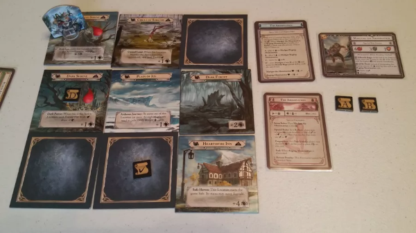
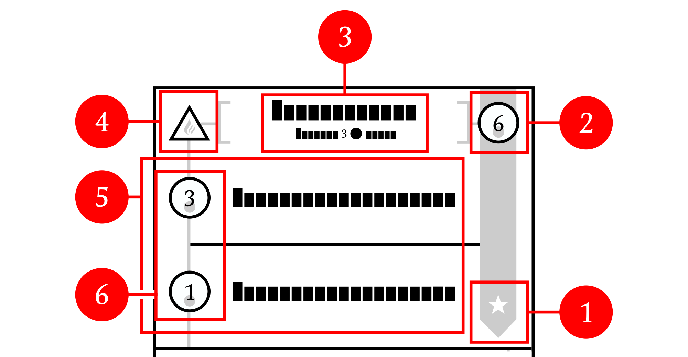
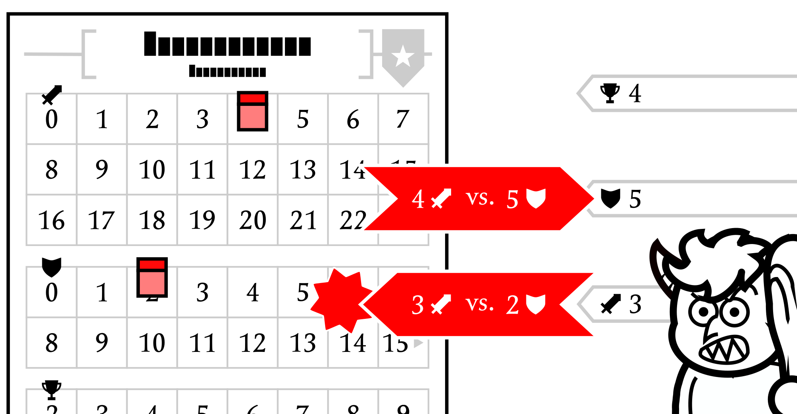

# Travelers of Stampadia

A print-and-play card roguelike with a new adventure every day!

---

<a href="https://www.kesiev.com/stampadia-travelers">Play today's adventure</a> | Read the manual: <a href="manuals/manual-en.pdf">EN</a> <a href="manuals/manual-it.pdf">IT</a> | <a href="https://www.kesiev.com/stampadia-travelers/learn.html">Learn how to play</a> | <a href="https://discord.gg/EDYP2N4RMn">Discord</a>

---

## The story

The reign of Stampadia had thousands of years of dangerous places and brave mercenaries before disappearing mysteriously from our globe.

But Stampadia Central Administration, generation after generation, managed to relentlessly archive the ID cards of every single inhabitant, the combat license of every single reckless hero, the maps of every single dungeon, and the papers hidden in them in a dossier called **Travelers Of Stampadia**.

    

We managed to find a damaged copy in an abandoned basement... and it looks like the documents are imbued with some kind of magic: the reader can live the owner's life moments with just some pawns and a pencil!

We’re recovering, translating, and digitalizing one new **document set** daily at https://www.kesiev.com/stampadia-travelers/. Go there, download the daily set, get it ready and bring back to life the world of Stampadia!

## The game

_Travelers of Stampadia_ is a print-and-play adventure card game with a little twist: the map, the enemies, the quests, the mysteries, and the traps are mixed and generated by an algorithm, as in a roguelike videogame. On the [Travelers of Stampadia homepage](https://www.kesiev.com/stampadia-travelers) you will find a unique adventure to download, print, and discover every day!

### Why?

_Travelers of Stampadia_ is a sequel/spin-off of the original [Chronicles of Stampadia](https://kesiev.com/stampadia) I worked on in the summer of 2021: an adventure game with very similar concepts that use roll-and-write mechanics instead of cards to be played.

With COS I explored multiple techniques to hide information _in plain sight_ on a fully visible sheet of paper to the player: the game uses grids and math to hide the dungeon planimetry, numbered checkboxes to hide the adventure logic, and keywords to hide overall progression. I followed some self-imposed limits to keep the project small, manageable, and stimulating enough: the whole game should fit a single sheet of paper, the basic manual shouldn't be longer than 6 pages, and the game material should be limited to a basic _kit_ for a roll-and-write game plus a pawn. Some more limits appeared during the development: sheet space restrictions prevented the project to be translated into multiple languages, the grid should include just a few details of the environment to hide the room's layout, and both these limitations kept its graphic design to the essential.

More importantly, COS was born as an _RPG alternative to crosswords_ to be played in summer under the beach umbrella for people who prefer scribbling on grids to live adventures instead of guessing words. And that's how I used COS in 2021, mainly because COS was the game I _needed_.

Summer was going to happen in 2022 too, so I needed more dungeon-crawling adventures to play under the sun. As any good _irresponsible board gamer_, I _precisely_ wanted to play a _new_ game that _feels_ like the one I already have but _different_ enough to justify the purchase. According to one of the untold rules in the board game industry, that game may be _the same as the previous one but implemented with different mechanics_ (like [Catan](https://boardgamegeek.com/boardgame/13/catan), [Catan Dice Game](https://boardgamegeek.com/boardgame/27710/catan-dice-game), and [Catan Card Game](https://boardgamegeek.com/boardgame/278/catan-card-game)), usually made to appeal to a broader audience. Last summer I enjoyed the [light](https://boardgamegeek.com/wiki/page/Weight) roll-and-write nature of Stampadia, but I'm more a mid-weight card game type. The planets were aligned enough to let me go back to the printer and think about _Chronicles of Stampadia But With Cards_, now _Travelers of Stampadia_.

I wanted to treasure all the feedback I received during COS development and add more features to the game while staying true to the original one: a simple and minimal computer-generated print-and-play roguelike dungeon crawler with a new adventure every day.

### The project

#### Reworking the limits

    

    
Preparing a set (from the TOS manual)

Cards are a little harder to print at home and surely need some work to be assembled, which can be a little annoying. But cards are usually double-faced, _technically_ giving the double amount of sheet space to work on, and they can be kept in hand, shuffled, partially or completely covered, placed side by side, rotated, etc. The advantages of using cards are way more than their limitations - but sadly for the designer only. To compensate I decided to add a new (challenging to design) feature to the project: heroes and adventures printed on cards should be playable _multiple times_.

To stay true to the original COS I also decided to rework two self-imposed limits to TOS: I must use a single _double-sided_ A4 sheet for every adventure and the card size must be a common one, to make them easier to be assembled. It means that the whole adventure must fit two sides of 9 poker cards, which can be assembled with a few poker cards and cheap card sleeves.

COS was built around pencil and eraser, two tools with a very long story in dungeon crawling games: they _theoretically_ allow any number of rooms on the map and, once a room is discovered and drawn, it stays there forever. Due to the mobility (and number) of the cards, that major advantage became a _heavy_ limitation that I had to address in some way making use of the card's flexibility the best I could.

Moreover, pencil and eraser were the foundation of any COS storage system: ticks were used for keeping track of the inventory, the adventure progress, the enemy and the player's health, and so on. Luckily there already are many solutions in board games, some involving moving, turning, and flipping the cards, and some others using some kind of token.

    

    
Required materials (from the TOS manual)

After exploring some of them, I used the card as much as I could and had to accept the idea of adding some kind of generical tokens, like little rocks, cubes from other board games, etc. to be placed on cards. I still want to not rely on them too much.

#### The two sets

    

    
Setting the game up (from the TOS manual)

In the original COS player stats and actions were kept in a relatively small area in the bottom right of the adventure sheet. In TOS instead, I'd like the player to hold the skills _in hand_, do some kind of hand management, and then _play_ them in some way to perform the hero moves. This means that, if I give the player a full hand of cards, it leaves just 4 cards for the whole adventure and that's way too little. So I decided to use one side of each of the 9 cards for the player and the other side for the adventure. This way you can't _technically_ play an adventure with just 9 cards but you can play 2 different adventures with 18 cards (2 sets of 9 cards). This fits the _material reusability_ feature I'm attempting very well since the fronts and the backs of different sets allow the player to play different adventures with different characters.

#### Card-based dungeon crawling

I love dungeon crawlers with maps and that was something I wanted to keep in TOS. I had to fit a procedurally-generated dungeon, the room descriptions, and the enemies in 9 cards. After some tests I managed to create a 24 rooms dungeon using 6 of the 9 cards as tiles to be arranged and rotated around the table multiple times... but the remaining 3 cards, used as indexes, fitted just very short descriptions of just 18 of the 24 rooms. Yeah... The game felt like the original COS, implicitly offering some new interesting mechanic, but the limited space on the index cards was cutting the already thin layer of setting.

    

    
Dungeon Adventure map symbols matching (from the TOS manual)

I came up with 2 solutions: using graphic cells for the card tiles instead of blank cells to add more context or dropping the dungeon exploration and thinking about something else. I ended up adding graphic cells to the tile cards _and_ thinking about something else.

#### Card-based world exploring

    

    
Mistfall's second quest The Abomination lays the place tiles in a 3x3 grid.

I needed another way to create something to explore with 9 cards that allowed a little more flavor text. Using single cards to describe an area and placing that on a grid is a quite common solution in board games (like in [Mistfall](https://boardgamegeek.com/boardgame/168274/mistfall) and the [Mini Rogue](https://boardgamegeek.com/boardgame/311715/mini-rogue)'s retail version) but, mixed with the procedural nature of the project, it suggested a new experiment.

    

    
In Mini Rogue's retail version the player explores a 3x3 grid of Room cards, moving from the top-left to the bottom-right.

COS and the TOS _Dungeon Adventures_ are inspired by old-school roguelikes, in which a procedurally generated planimetry is filled with stuff that may kill or help you. Some more modern roguelikes, especially metroidvania-inspired ones like [A Robot Named Fight!](https://store.steampowered.com/app/603530/A_Robot_Named_Fight/) and [Sundered](https://store.steampowered.com/app/535480/Sundered_Eldritch_Edition/), have some kind of _superstructure_, in which procedurally placed _biomes_ interact with each other to open new paths and offer some backtracking.

    

    
A Robot Named Fight! Mega Map mode: "In Mega Map all environments in the game are combined into one large, randomized labyrinthine map featuring 11 traversal items." (From <a href="https://twitter.com/robotnamedfight/status/1291814864260870145">@RobotNamedFight</a> Twitter)

It may be difficult and fiddly to implement with paper but, luckily, I just had 9 cards to manage, so I could think _small_ enough to test this approach.

    

    
Preparing the World Adventure map (from the TOS manual)

I used the two halves of a card and made them turn upside-down on player actions to create these _area changes_ in a way very similar to the COS checkboxes. I managed actions consequences using the lower part of each card, so the card's position on the grid was not relevant anymore: harder challenges will progressively appear as the player turn the cards. This way these _World Adventure_ cards can be shuffled and put on the table randomly, creating a slightly different adventure every time (some bonus/malus may be reachable sooner or later during the game depending on the card position on the 3x3 grid) and hitting the _material reusability_ feature once again.

    

    
World Adventure enemy gaining a bonus (from the TOS manual)

With half of a card available, I managed to put even more text than in COS, with illustrated (and procedurally generated depending on their job and race) enemy art and more complex interactions. Randomly placed cards also allow to change a card behavior depending on the card position on the grid, so I spiced up enemies with random bonuses, gained depending on the card on their right.

#### The resources ecosystem

As a board game player, I've always found it fascinating how board game designers, especially in the card-based battle genre, are often able to create interesting puzzles carefully balancing game element synergies. In COS it was relatively easy to keep some kind of balance between game elements since the ones of the same adventure were printed on the same sheet. So the character stats, the enemies stats, and the items were balanced depending on the generated adventure... but this time the hero and the adventure are in _two separate_ sets of cards and, even in the same set, the Hero Cards are drawn randomly.

I soon realized that my tastes weren't fitting my skills... but I tried my best to find a solution anyway. I designed the cards to have multiple collectible resources depending on how the cards are placed and made them a little different from each other:

    

    
Hero Card structure (from the TOS manual)

  - Attack and Defense are collectible with no limit but must be paid with Mana
  - Mana can be collected and spent but it's limited by the player's level
  - Banners are collected _for free_ when performing the common action of collecting Mana and they can be changed a little by other actions
  - Elements are collected with more expensive actions and can just go up
  - Constellations are collected and spent in a set-collection fashion
  
Once I've set the resources and how the player can gain them, I tried to get the _implicit value_ of all of them and set _resource tradings_ in cards actions that are advantaging and affordable depending on the hero level, the symbols in the deck, etc... mainly writing a _player simulator_ and letting the computer play a huge amount of hands. Then I set Attack and Defense threshold based on these values... and tuned everything by hand testing the game many times with my wife.

    

    
Strain action (from the TOS manual)

During the tests, I've added the _Strain_ action, which allows the player to use any card to gain 1 Attack or 1 Defense. It's a _pricey_ action the player can use to gain a little of what exactly needs that you can find in many card-based exploration board game adventures like [Mage Knight Board Game](https://boardgamegeek.com/boardgame/96848/mage-knight-board-game) and [Gloomhaven](https://boardgamegeek.com/boardgame/174430/gloomhaven) and helps on mitigating edge cases while introducing more choices. Due to its _mitigating_ effect, the simulated player can never use the _Strain_ action.

    

    
From Mage Knight's manual: "Any card (except Wounds) can be played as Move 1, Influence 1, Attack 1, or Block 1. To do so, just play it sideways on the column."

I worked on 2 classes (The Swordmaster and The Elementalist) mainly changing the value and availability of their resources and creating some ad-hoc actions they can perform to trade them.

    

    
Performing an attack using the tracker card (from the TOS manual)

I needed something to track the _unlimited resources_, so I used one of the 9 cards as a resource tracker. That leaves me 8 cards for skills, which is barely enough to create a player's hand and surely not enough to make the gameplay I wanted. I split the cards in two, like in _World Adventures_, and then added up to 2 skills per half, so the player must do some little hand and cards management to create a good sequence of cards and chain resources and abilities to get Attack and Defense.

    

    
Hero card flow (from the TOS manual)

Hand management implies some more _implicit_ resources, like the number and type of cards in hand, in the discard deck, in the removed cards deck, etc. and I decided to move the ways to manipulate them to the adventure cards: moving around the map and reaching places should change the hand a bit, so the player must plan his route to create the best hand for his next battle - mixing the COS _dice placement_ combat system with its _Time is Gold_ rule.

#### Hero card puzzles

In COS the gold resource has been used both to buy/sell resources and to create a time limit: the player had to spend 1 gold every time his hero crosses a door so a little route planning was needed to get a good score - and sometimes to clear the dungeon. To let the player manipulate the upper/lower sides of TOS Hero cards, I've reworked the gold logic taking inspiration from a core mechanic of a board game I backed on Kickstarter in 2020 and liked _a lot_: the [Ruins: Death Binder](https://boardgamegeek.com/boardgame/280984/ruins-death-binder) _deck-leaking_ mechanic.

    

    
Ruins: Death Binder action cards (From BGG)

In Ruins: Death Binder the player starts with all of the action cards but _loses_ them inexorably, due to the enemies' actions, the hero's capabilities, and the player's choice. The player must carefully choose the cards to give up, compromising his limits and the enemies he encounters.

I liked how the game flipped the standard _cards market_ system of deck-building games, giving instead _all of the cards_ to the player and forcing him to decide what to keep. TOS cards are just 8 so I needed the player to have all of them. I decided to do so and tried to merge the _deck-leaking_ mechanic with the COS gold mechanic. So in TOS the player starts with all of the cards but they will _change_ as the hero takes hits, the player decides to (or can't) pay for keeping them after, or the enemy hits. These changes may let the cards change, becoming more powerful but harder to use or weaker but more flexible, or be removed from the game.

COS battle system was thought to be accessible and light: it was based on dice rolling, dice placement, and a very simple movement on the map. With the TOS resources ecosystem, I wanted to make them tiny optimization puzzles, in which the player must think about how to get the best of his hand or try changing some cards if he feels they aren't good enough. In these puzzles, finding a way to give the player in a _managed random way_ is very important.

One of the most famous _optimization puzzle videogames_ is [Tetris](https://en.wikipedia.org/wiki/Tetris): the player must find a way to fit the pieces the game gives to him to form lines to remove them and keep enough room to play more. The early Tetris games, like _glorious_ [Game Boy Tetris](https://en.wikipedia.org/wiki/Tetris_(Game_Boy_video_game)), used to pick the pieces in a fully random way: this way the player had to wait _indefinitely_ for the piece he needs, making the game a frustrating _wait and stack_ endurance challenge. Different game chapters introduced different techniques to mitigate the problem and most of them are collected into the [Tetris Guidelines](https://tetris.fandom.com/wiki/Tetris_Guideline), a set of specifications [The Tetris Company](https://en.wikipedia.org/wiki/The_Tetris_Company) enforces to official Tetris game makers. 3 of the most famous ones are the _multiple next pieces_, the _Hold Piece_, and the _7-bag Random Generator_. 

    

    
Tetris The Grand Master 3 Terror-Instinct, with multiple next pieces preview and the holding area

_Multiple next pieces_ allow the player to preview more than 1 next piece, allowing better strategies. The _Hold Piece_ allows the player to keep the falling Tetramino apart and swap it with the current one when needed, giving the player more control over the sequence of the pieces (and, in a way, more time to think). But, in my opinion, the most interesting is the _7-bag Random Generator_: all of the 7 one-sided different pieces are put in a _virtual bag_ and then drawn one by one and given to the player. This way the pieces are still drawn randomly but in a _semi-predictable_ way, making the game fairer and limiting the _wait and stack_.

This _bag-based generator_ is pretty common in card games since card decks work like bags: they are shuffled and then cards are drawn one by one to form the player's hand. When the game goes on, the fewer the deck cards are the more predictable the next cards will be. But there are card games in which _precise resource optimization_ is needed and, in a way, they implement the board game equivalent of Tetris _multiple next pieces_ and _Hold Piece_. One of these games is [Aeon's End](https://boardgamegeek.com/boardgame/191189/aeons-end) and his _incredibly prolific_ series.

    

    
Aeon's End: War Eternal (From BGG)

In Aeon's End, the player deck is _never shuffled_ and the player may discard the played cards _in any order_. The player must plan _when_ and _how_ to discard cards to build useful sequences into his deck to be drawn in the future. It's a very interesting mechanic, that should fit TOS pretty well and may reduce the times the player has to shuffle his (very small) deck. In TOS the deck is shuffled just when the battle starts and _never shuffled_ until the end: the player must play his cards to _sort_ the cards to draw the needed sequence in the future.

#### Improving COS

After planning the backbone of the game I tried to port most of the COS contents in both TOS adventure types: some of them came up nicely, some others needed heavy adaptations, and some didn't make it.

Surely TOS design brought a brand new set of limitations, but also offers opportunities to implement some of the COS improvements I've collected after his launch. We talked about how illustrations were a _forced improvement_ over COS... but I also tried to add some improvements _intentionally_ ;).

In Dungeon Adventures I've added walls in rooms to make rooms a little more interesting and removed the basic math needed to find the next room when moving around.

    

    
Dungeon Adventure tile card walls (from the TOS manual)

Tile cards are heavily reused, so some map parts "disappear" little by little, simulating the hero memory or some kind of _fog of war_ and I've found that super interesting: the dungeon generator calculates the space taken by cards on the table so, even if it's impossible to see the whole dungeon using just 6 cards, there is a _true consistent map hidden under the table_ and the player can see just part of that moving the hero around. There is an untold thing that the player may do to help himself... and that's keeping a map on a squared sheet of paper. Dungeon mapping has been moved _outside the game_, as it used to be in old video games. Nice!

This card recycling technique also allows a new mechanic, which can _replace_ the checkbox system of CAS on _Dungeon Adventures_ in some cases: during the dungeon generation, I can check if the player did a specific set of routes by asking if a symbol is still on the table at the destination. If the player took the wrong route, the symbol shouldn't be there. The player should roam a little around to explore the whole dungeon.

_World Adventures_ are a little simpler than Dungeon Adventures and some of the original COS adventures but, unlike for COS, there is a lot of free space on the cards for text now. I've used part of that space for illustrating enemies but there is another very requested feature that I could attempt to implement. And that is _multiple languages support_.

#### Translating a card game

Flavour text in TOS was made with a lot of relatively short sentences. The hero's actions and adventure events were instead a little trickier to translate since they use parametrical short sentences with precise words to describe what the player has to do. And in card games, _they are a lot_.

    

    
The same World Adventure card in English and Italian

Luckily all of the hero cards were already generated in a _machine-readable_ format to let the _player simulator_ play them. From that format I've generated the localized sentences, using a dictionary/template system evolved from COS. The TOS dictionaries have a quite complex hierarchy so I've made some tools to flatten it, translate sentences with spreadsheets, and then put everything back in the right place. This time I started with the Italian language since its sentences are usually longer than the English version.

#### The manual

Writing manuals is _always painful_ and that's something you soon realize just _reading a bunch from other games_. It seems that there isn't a right way to do that: some complex board games may have thin and clever manuals while simple party games may require you to read the manual for some minutes. Whatever the manual, what the player is going to think _after_ reading that is often the same: "This game flow is obvious and straightforward.... why does this manual take this long to explain that?". It's some kind of _board game manual curse_: different explanation pieces _click_ in different players' minds so manuals often give _multiple pieces multiple times_ to work in as many cases as they could.

    

    
The Travelers of Stampadia manual

In COS I self-imposed the maximum manual length of 6 pages and, in some way, it _backfired_. There was just enough room to explain the rules, so I missed the _other pieces_ manuals usually offer for reiterating their explanations, like examples, tutorials, and pictures. This time I decided to remove this limitation and rely on _some good sense_ for keeping the game simple enough. Now the manual is more than 3 times longer than COS but includes a lot of images, a simple interactive tutorial, and a quick reference.

I'm still using PDF-converted [LibreOffice](https://www.libreoffice.org/) Writer documents, but this time I'm generating them from a descriptor. I've built another placeholder system for manuals, since text formatting is more important and dynamic than on cards, and I'm using that to make sure to use the same terms when talking about the same thing. I'm using the same placeholder names for all of the manuals let supporting people with rules a little easier.

#### New walls

Keeping a low-ink design is important for print-and-play games and it's even more important for _serial_ games like Stampadia. Luckily that design matched the roll-and-write old-school nature of COS pretty well but in TOS it has been a harder decision to make.

In roll-and-write games, elements are always in the same place so the player's eyes can quickly zip from one to another: the map is on the left, the hero sheet is on the bottom right, the gold bar is on the top, etc.

    

    
The same hand in black and white and colors. Attacks and defenses are easier to spot and colored symbols make combos easier to spot.

In card games all of the elements are _always_ moving around: cards change place in hand, they move and flip around the map, etc. So card games usually use colors and pictures to help the player to _classify_ them in one look: red cards for attacking, green for healing, etc.

In TOS _World Adventures_ grid-like maps, cards don't move so much. In _Dungeon Adventures_ cards don't truly _move_ but they _disappear_ to later appear in the same place. _Hero cards_ symbols placement is strictly bound to how to play them: you can _earn_ everything that's on the left or the right of the card. But card action descriptions, even if short, are harder to spot without reading them every time so different background colors or illustrations may help to recognize attacks, defenses, or special moves.

Card names are procedurally generated depending on their skills but the player still needs to read some text to use identify a card. This issue doesn't break the game... but I'll keep that in mind.

#### Wrapping up

Starting from COS, I did my best on putting together a _tiny_ card game, trying to make the most of what I have learned for passion and getting inspiration from the games I love. As usual, I also wanted to share _the full package_ too, from the design choices to the whole code, because that's how I learn the stuff I know.

But, _hey_. I'm not a _professional game designer_ and, as for COS, my first objective was to make a game that I could enjoy under the beach umbrella and TOS _hits the spot_ for me. I hope that some others out there will enjoy this stuff too! Thank you very much for coming this far!

### Font

The game manual and the card packs are using the excellent CC0 fonts [Seshat](http://dotcolon.net/font/seshat/) and [Ferrum](https://dotcolon.net/font/ferrum) by Dot Colon. If you're going to have a look at the manual generation tools `assets/manual/` and the adventure sheet model `svg/model.svg` make sure you have got these fonts installed. A copy of these fonts is included in the `assets` directory.